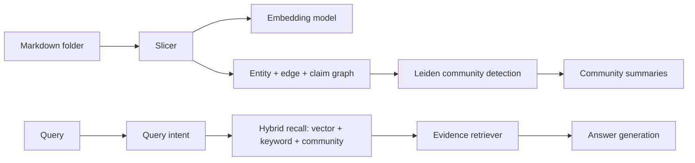

# Architecture

`graphrag-ts` implements a chunked GraphRAG pipeline. This document describes the
modules and the data flow.

## Ingestion (`src/build/`)

- **Slicing** (`textSplit.ts`): decides between LLM-assisted slicing and a
  deterministic markdown-structure splitter based on content size
  (`DETERMINISTIC_THRESHOLD`, `MARKDOWN_STRUCTURE_THRESHOLD`). LLM output is
  validated; empty or invalid output falls back to the deterministic path.
- **Graph construction** (`buildEdges.ts`, `buildEntities.ts`, `buildClaims.ts`):
  turns slice output into `rag_graph_edges`, `rag_entities`, and `rag_claims`
  rows, with SHA-256 claim deduplication.
- **Community detection** (`detectCommunity/`): Leiden clustering via
  `@graphrs/igraph-wasm`, then per-community summaries are generated and grounded
  in the community's member nodes and claims.
- **Build registry** (`buildRegistry.ts`): in-memory `BuildRegistry` tracking
  build lifecycle (pending -> running -> succeeded/failed).

## Retrieval (`src/retrieval/`)

- **Query intent** (`query/queryParser.ts`): extracts entities and keywords.
- **Recall** (`recall/`): three complementary channels:
  - `vectorSearch.ts`: embedding similarity over child chunks (HNSW).
  - `keywordSearch.ts`: ILIKE-based keyword search to recover exact fact phrases.
  - `communityResolver.ts`: recursive CTE reachability over the entity graph.
- **Ranking** (`ranking/communityRanker.ts`): ranks candidate communities by
  relevance.
- **Evidence** (`evidence/evidenceRetriever.ts`): converges members + claims into
  a bounded evidence window.
- **Answer** (`answer/answerGenerator.ts`): grounded answer generation over the
  evidence.

## Configuration

Models are configured purely through environment variables (see `.env.example`):

| Variable | Purpose |
| --- | --- |
| `RAG_SLICE_API_KEY` / `RAG_SLICE_MODEL` / `RAG_SLICE_BASE_URL` | chat model for slicing |
| `RAG_JUDGE_API_KEY` / `RAG_JUDGE_MODEL` / `RAG_JUDGE_BASE_URL` | chat model for judging |
| `RAG_EMBED_API_KEY` / `RAG_EMBED_MODEL` / `RAG_EMBED_BASE_URL` | embedding model |
| `RAG_COMMUNITY_CONTEXT_MAX_TOKENS` | token budget for community summaries |
| `DATABASE_URL` | PostgreSQL connection string |

## Database

The schema (`prisma/schema.prisma`, `prisma/migrations/0001_baseline/migration.sql`)
contains six `rag_*` tables. The baseline migration creates them plus the HNSW
index used for vector recall. Run `bun run db:push` or apply the migration with
`prisma migrate deploy`.

## Testing

Unit tests (`src/**/*.test.ts`) run with `bun test`. They stub the Prisma client
and the model loader, so **no live database or LLM is required**.
